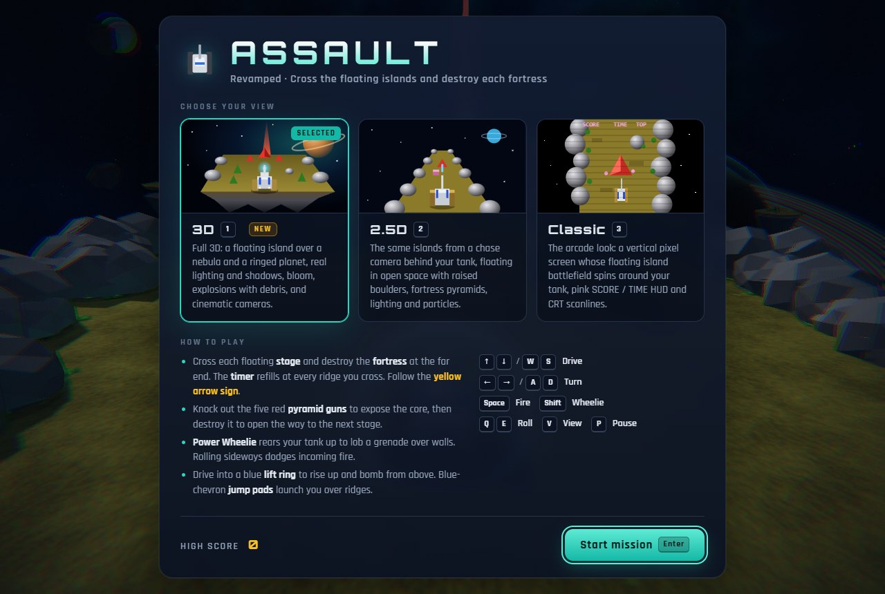
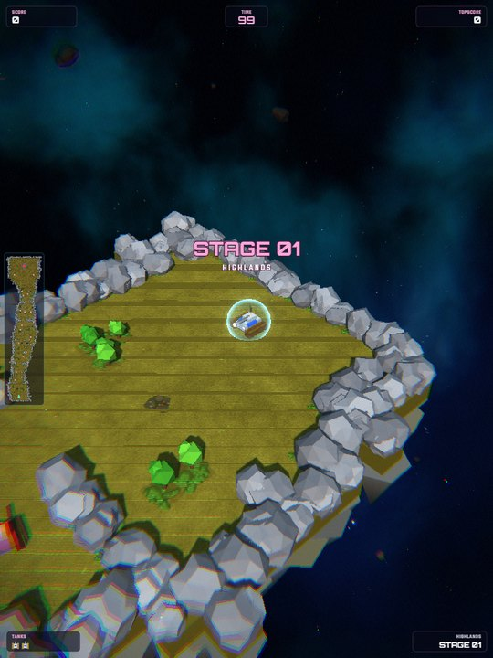
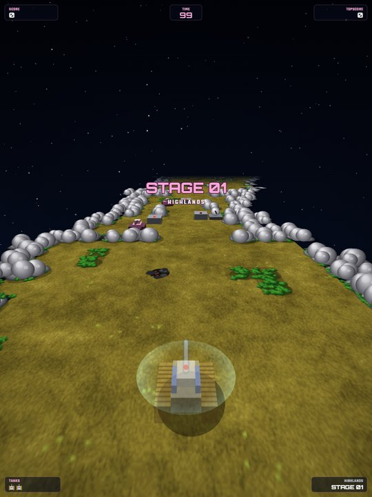
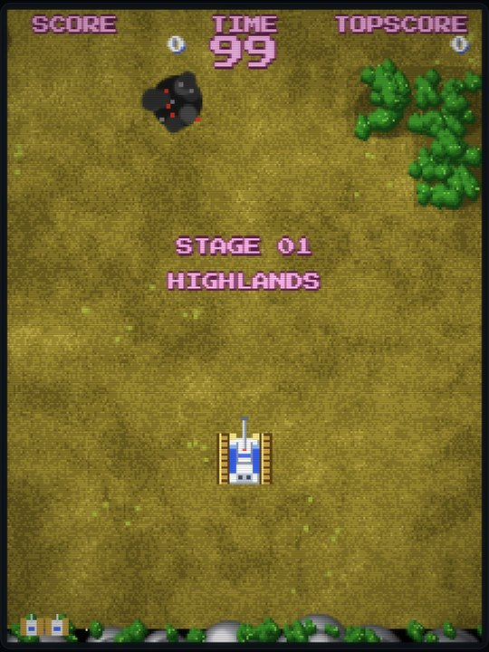
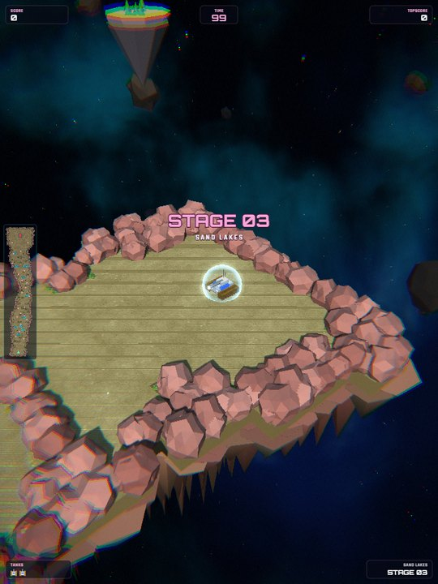

# Assault Revamped

A revamped remake of **Namco's 1988 arcade *Assault***, the top-down tank shooter whose whole battlefield rotates around your tank. It's written in plain HTML5 canvas, WebGL (Three.js, vendored) and JavaScript, with no build step and no image or audio files. Every map tile, sprite, 3D model and sound effect is generated in code.



Each stage is a floating island in open space, edged by puffy rock cliffs and foliage, with a stone pentagon fortress at the far end. The look follows the arcade original: a vertical screen, the pink `SCORE / TIME / TOPSCORE` HUD, a white-blue-gold tank, pink enemy tanks and bullets, and red pyramid guns around a red core.

You pick one of three views on the start screen (keys **1**, **2**, **3**). Press **V** during play to cycle through them at any time.

| 3D | 2.5D | Classic |
|:--:|:--:|:--:|
|  |  |  |

| View | Look |
|------|------|
| **3D** | A full WebGL scene. The island is a real landmass with a rocky underside hanging over a nebula and a ringed gas giant. Boulders, trees, buildings and units are lit 3D models with soft shadows, an HDR bloom pass, explosions that throw fire, smoke, sparks and debris, a minimap, and a camera that follows the tank. Only offered when the browser supports WebGL. |
| **2.5D** | The same islands seen from a chase camera that turns with the tank. The island is drawn Mode-7 style and floats in space, with a nebula and planet behind it. Boulders, structures, fortress pyramids and every unit are raised 3D shapes, with shadows, floor lighting and particles. |
| **Classic** | The arcade presentation. A vertical 224×288 pixel screen whose island playfield rotates around the tank with nearest-neighbour sampling, over a starfield that turns with it. It uses pixel-art units, the arcade HUD, the yellow exit sign, and craters left by explosions, with CRT scanlines and bloom on top. |

Each stage theme has its own palette. Stage 3, the sand lakes, has pink rock cliffs:

<p align="center"></p>

## Play

Serve the folder over HTTP and open it in a browser:

```bash
python -m http.server 8765
# then open http://127.0.0.1:8765
```

Opening `index.html` directly from disk also works.

Add `?demo=three|modern|classic&stage=N` to the URL to skip the menu and watch the autopilot play that view and stage with the HUD on. This is how the screenshots above were taken.

### Controls

| Action | Keyboard | Gamepad |
|--------|----------|---------|
| Drive forward / reverse | ↑ ↓ / W S | Left stick / D-pad |
| Turn | ← → / A D | Left stick / D-pad |
| Fire cannon | Space / J | A / RT |
| Power Wheelie (grenade) | Shift / K | B / Y / LT |
| Roll left / right | Q / E | LB / RB |
| Cycle view (3D → 2.5D → Classic) | V | — |
| Pause | P / Esc | Start |
| Sound | M | — |

Touch devices get an on-screen d-pad plus FIRE, NADE and roll buttons.

### Rules

- Each **stage** is a floating island that ends in an enemy **fortress**. The two-digit **timer** refills every time you cross a ridge or river. A yellow **arrow sign** points you toward the fortress.
- The fortress has five red pyramid guns. Destroy all of them to **expose the core**, then destroy the core. A hole opens in the fortress ("NOW YOU ASSAULT ON NEXT STAGE!!"), and you get a bonus for whatever time is left.
- Enemies are tanks, rotating gun turrets, mortars that lob shells at a marked target, and helicopters that fly over walls.
- Your cannon shots can knock down enemy shells, but not red plasma.
- A **Power Wheelie** rears the tank up and lobs a grenade over walls. The blast also destroys bunkers and other structures.
- **Rolling** sideways dodges incoming fire.
- Driving into a blue **lift ring** raises you into the air. While you're up there you can't be hit by ground fire, the view zooms out, and your fire button drops bombs. Each lift zone works once.
- **Jump pads** launch you over the next barrier. Your landing sends out a shockwave.
- Stages cycle through five themes: highlands, jungle river, sand lakes, city block and enemy base. They get longer and more heavily defended as you go. Crossing a ridge also sets your respawn checkpoint.

## Structure

```
index.html              page shell, start / pause / game-over modals
css/style.css           UI styling
js/game.js              floating-island stage generator + simulation + attract-mode AI
js/tiles.js             terrain painter (ground noise, rock cliffs, foliage, water, city, base, fortress)
js/audio.js             WebAudio synthesized sound effects
js/render-classic.js    Classic vertical-screen rotating pixel renderer
js/render-25d.js        2.5D chase-camera renderer (mode-7 island in space + 3D geometry)
js/render-3d.js         3D WebGL renderer (Three.js scene, shadows, bloom, particles, minimap)
js/vendor/three/        Three.js r147 + EffectComposer / UnrealBloomPass (MIT)
docs/screenshots/       README images
js/main.js              loop, input (keyboard/gamepad/touch), view switching
```

All three renderers read the same `Game` state and consume the same event stream, so gameplay is identical in every view. The 3D view draws its HUD with the 2.5D renderer's panel code on a canvas layered over the WebGL canvas. The simulation runs at a fixed 120 Hz step.

Stages are generated from a seed, so each stage number always produces the same map. The generator checks that every map is passable from start to fortress, and builds a distance map that drives both the exit arrow and the attract-mode autopilot.

The high score, the last chosen view and the mute setting are saved in `localStorage`.
